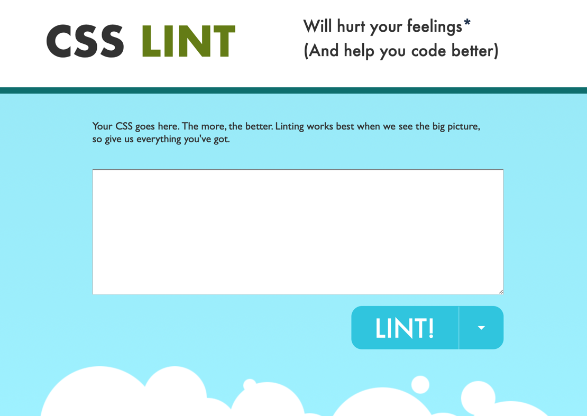

# 主要内容
1. html、js、css规范
2. 格式化插件的使用
3. 首页demo演示
# html、js、css规范
> 目前没有统一的代码规范，这里主要借鉴了阿里个人团队上传的开发团队规范。
## 好处
* 为以后实现“大前端”养成习惯
* 方便交接和后期维护
* “严格模式”下的页面性能优化
## html编码规范
> 现在大多数情况下都是模块开发，所以开发人员很少有写一个完整的html的场景，这里只是将必须遵守的要求列出
### 基本语法
* 在属性上，使用双引号`` "" ``,不要使用单引号`` '' ``
* 属性名、属性值全部小写，用中划线``-``做分隔
* 不要在自动闭合标签结尾处使用斜线，例：``
* 不要忽略可选的关闭标签，例：`</li>` 和 `</body>`
* 如果框架没有要求，自定义属性必须使用 `data-` 前缀
* 使用html（h5）来声明doctype
```html
<!-- 页面框架 -->
<!DOCTYPE html>
```
* 尽量使用语义化标签
### 字符编码
如项目没有特殊要求，必须使用utf-8
```html
<!DOCTYPE html>
<html>
    <head>
        <meta charset="utf-8">
    </head>
</html>
```
### IE 兼容模式
用 `<meta>` 标签可以指定页面应该用什么版本的 IE 来渲染，PC 端项目，建议启用 IE Edge 模式
```html
<!DOCTYPE html>
<html>
    <head>
        <meta http-equiv="X-UA-Compatible" content="IE=Edge">
    </head>
</html>
```
## js代码规范
## css代码规范
# 格式化插件的使用
## 目前流行的js格式化插件
* esLint  

* jsHint  

* jsLint  
  
jsHint比较严格且配置繁琐，jsLint网上评价不是太好，顾这里推荐使用esLint作为js格式化插件
### esLint的安装
>目前市面上大多数IDE都支持esLint插件的安装，这里以VSCode为例。
1. 在扩展界面上直接搜索eslint即可，安装后需要重新加载。
2. 在项目中安装：
``$ npm install eslint --save-dev``
由于每个项目的要求可能会不同，在这里推荐在项目内进行安装，不要使用全局安装
3. 生成配置文件：`` eslint --init``
4. 修改配置文件
5. 在VSCode中指定配置文件(默认自动加载)  
`` "eslint.options": {
    "configFile": "E:/git/github/styleguide/eslint/.eslintrc.js"
},``
### 支持vue单文件
由于 ESLint 默认只支持 js 文件的脚本检测，如果我们需要支持vue文件的内联脚本检测，还需要安装 eslint-plugin-html 插件。  
``$ npm install -g eslint-plugin-html``  
在VSCode上配置：  
`` "eslint.options": {
    "configFile": "./.eslintrc.js",
    "plugins": ["html"]
},
"eslint.validate": [
    "javascript",
    "javascriptreact",
    "html",
    "vue"
]``
### 配置esLint
* 指定环境  
`` "env": {
    "browser": true,
    "commonjs": true,
    "es6": true,
    "jquery": true
}``
* 设置脚本语言
`` "parserOptions": {
    "ecmaVersion": 6,
    "sourceType": "module",
    "ecmaFeatures": {
        "jsx": true//jsx语法
    }
}``  
默认情况下，ESLint 支持 ECMAScript 5 语法，如果你想启用对 ECMAScript 其它版本和 JSX 等的支持，ESLint 允许你使用 parserOptions 属性进行指定想要支持的 JavaScript 语言选项(需要安装插件)。
* 配置项目代码规范
``"extends": "eslint:recommended"`` 选项表示启用推荐规则，在这里我们不启用，规则中每个属性的值含义都相同：
    * "off" 或 0 - 关闭规则
    * "warn" 或 1 - 将规则视为一个警告
    * "error" 或 2 - 将规则视为一个错误  
    完整的配置说明大概有200多条，在这里只举例说明  
    ``` 
    "rules": {
        //缩进风格  
    "indent": [  
        "error",  
        4  
    ],
    //换行风格
    "linebreak-style": [
        "error",
        "windows"
    ],
    //引用类型(为了与json区分)
    "quotes": [
        "error",
        "single"
    ],
    //语句强制分号
    "semi": [
        "error",
        "never"
    ]
    }
    ```
    中文文档https://cloud.tencent.com/developer/doc/1078（腾讯云）
## 目前流行的css格式化插件
* cssLint  

在线编译工具，http://csslint.net，在实际项目中我们大致都是使用vue来编写前端，而vue的打包机制是基于模块的，所以这里不推荐在自动化打包工具中使用css格式化插件，如果实在对自己的代码没信心，可以将代码复制到上面网站中进行在线检查。  
### 什么情况需要css的代码格式检查
1. 修复解析错误。
2. 针对IE6及以下的多类选择器报错问题检查。
3. 移除空的css规则（一般为了预留样式）。
4. 正确使用display的属性：
由于display的作用，某些样式组合会无效，徒增样式体积的同时也影响解析性能。CSSLint会检查一下几点：
    * display:inline后不应该再使用width、height、margin、padding以及float。
    * display:inline-block后不应该再使用float。
    * display:block后不应该再使用vertical-align。
    * display:table-*后不应该再使用margin或者float。
5. 不滥用浮动：CSSLint一旦检测出样式文件中有超过10次的浮动便会提示警告。
6.不声明过多的font-size。
7. 不在选择符中使用ID标识符：主要考虑到样式重用性以及与页面的耦合性。
8. 不给h1~h6元素定义过多的样式。 
10. 值为0时不需要任何单位。
11. 标准化各种浏览器前缀包括渐变前缀。
# 首页demo演示
以格力宿舍管理系统为例
# 几点说明
* 开始时候开发效率确实低
* 持续维护
